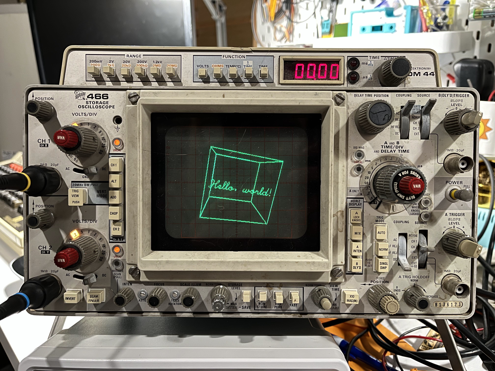

# VectorGFX

Simple library for oscilloscope vector graphics on the ESP32



## Background

VectorGFX is inspired by (and heavily based on) the
[V.st](https://trmm.net/V.st/) project by Trammell Hudson et al. V.st
uses simple dedicated DAC hardware, controlled by a Teensy 3.1 microcontroller
dev board, to drive vector displays over a serial port.

The popular ESP32 microcontroller already has a pair of onboard DACs, and since
I don't have a V.st board, but my junk drawer is full of ESP32s, I thought I
might as well turn them to a similar purpose.

## CAUTION

First off, a word of warning:

When using an oscilloscope in X-Y mode, permanent phosphor burn-in is possible
if the beam is allowed to stay in one place for too long. VectorGFX is unable to
control the brightness of the oscilloscope beam, and it is important to turn the
brightness down immediately if the beam is allowed to become stationary (e.g.
when the ESP32 is powered off, or being programmed).

## Setting it up

`VectorGFX` does not require any additional hardware, beyond an ESP32 and an
oscilloscope. Set your oscilloscope into X-Y mode, and connect the X-channel
probe to GPIO 25, and the Y-channel probe to GPIO 26.

The included 'serialvector' example sketch displays a simple test pattern at
power-on, which can be useful for adjusting the oscilloscope's scale and
position controls.

## Using `VectorGFX`

The `VectorGFX` class provides a simple API for drawing vector graphics and
keeping the DMA engine fed. Simply call the `begin()` method in your setup
function, use the `moveto()` and `lineto()` methods to draw some lines, then
call `display()` to show them on the screen.

`VectorGFX` uses a 4096x4096 coordinate system - (0, 0) is the bottom-left
corner, while (4095, 4095) is the top-right. Note that on the ESP32, this gets
condensed down to 256x256 displayable points, but the higher 'virtual'
resolution will allow for future expansion to use external DACs.

The following code provides an example, alternating between showing a box, an X,
and then both.

```c++
#include <VectorGFX.h>

VectorGFX gfx;

void draw_box(uint16_t x0, uint16_t y0, uint16_t x1, uint16_t y1) {
    gfx.moveto(x0, y0);
    gfx.lineto(x1, y0);
    gfx.lineto(x1, y1);
    gfx.lineto(x0, y1);
    gfx.lineto(x0, y0);
}

void draw_x(uint16_t x0, uint16_t y0, uint16_t x1, uint16_t y1) {
    gfx.moveto(x0, y0);
    gfx.lineto(x1, y1);
    gfx.moveto(x0, y1);
    gfx.lineto(x1, y0);
}

void setup() {
    gfx.begin();
}

void loop() {
    // Draw a border around the edges of the screen
    draw_box(0, 0, 4095, 4095);
    gfx.display();  // Must call display() to flip buffers and display the image
    delay(1000);

    // Draw an X between the corners of the screen
    // Note that we start with a clean slate after the call to display() earlier
    draw_x(0, 0, 4095, 4095);
    gfx.display();
    delay(1000);
    
    // Draw a box and an X together
    draw_box(0, 0, 4095, 4095);
    draw_x(0, 0, 4095, 4095);
    gfx.display();
    delay(1000);
}

```

For full API documentation, see the comments in `src/vectorgfx.h`.

## Examples

### `simpledemo`

The basic demo shown above.

### `serialvector`

A simple sketch that receives vector data over the serial port and displays it.
Based on (and compatible with) the protocol used by
[V.st](https://trmm.net/V.st/). See the comments at the top of
[`serialvector.ino`](examples/serialvector/serialvector.ino) for details.

The [`examples/serialvector/python`](examples/serialvector/python) directory
contains a simple Python library and example code for sending vectors from a PC.
Note that the included libraries require the `HersheyFonts`, `pygame` and
`pyserial` packages to be installed.

## Technical details

The ESP32 has two 8-bit, DC-coupled DACs, available on GPIOs 25 and 26. These
DACs can be written to directly by software, and bitluni [got some excellent
results](https://bitluni.net/oscilloscope-as-display) driving an oscilloscope in
this fashion. However, this approach is somewhat limited in speed, and directly
coupled to the execution of code on the device - this causes noticeable
flickering when more than a handful of vectors are displayed, and uneven
brightness depending on code paths and any background tasks.

However, the DACs can also be driven by the ESP32s DMA engine. This allows the
DACs to be written to at a much faster rate, allowing more vectors to be
displayed, and ensures a consistent update rate, giving a uniformly bright
image.

Even with DMA, keeping the display updated requires frequent CPU intervention.
This is accomplished by `displayTask`,  a high-priority FreeRTOS task that is
started when the `begin()` method is called - code using `VectorGFX` does not
have to do anything to maintain the display.

`displayTask` is responsible for transforming the list of vertices into a stream
of DAC samples - `moveto` vertices correspond directly into samples, moving the
oscilloscope beam instantaneously, while `lineto` vertices are swept across the
screen using Bresenham's Algorithm, to produce a visible line. The generated
samples are then buffered, and periodically flushed to the ESP32's DMA engine.

The priority of `displayTask` is a delicate balance - it needs to be high enough
to avoid DMA underrun, but also avoid starving other tasks of CPU time. The
default priority of 24 should ensure that in a basic configuration with WiFi and
Bluetooth turned off and no higher-priority tasks running, `displayTask` should
get CPU 0 to itself.

## Troubleshooting

### The image flickers

The refresh rate of the display corresponds directly to the complexity of the
image being displayed - specifically, the number and length of lines that are
drawn. The minimum acceptable refresh rate is highly dependent on the type of
phosphor on the screen.

### The image has uneven brightness and/or a bright dot in the bottom left

`displayTask` is unable to keep up with DMA, and buffer underruns are occurring.

Either increase the priority of `displayTask`, or provide more opportunities for
`displayTask` to run by adding calls to `taskYIELD()` in your code.

### The image jumps around and has visible noise in it

The ESP32 is a cheap device, and the output of its DAC is not particularly
clean. Some amount of noise and instability is to be expected. Note that noise
increases significantly if the Wifi or Bluetooth radios are active.

### Lines are curved at the ends and corners

A degree of geometric distortion is to be expected, but it can be reduced by
ensuring that any bandwidth-limit settings on the oscilloscope are turned off,
and the oscilloscope inputs are set to DC coupling.

## Caveats

### Low resolution

The 8-bit dacs only allow for a 256x256 resolution. This is not a huge problem
on a typical small oscilloscope screen, but it does cause lines to be visibly
jagged.

### No brightness/blanking output

Since we only have 2 DAC channels, a brightness output cannot be generated along
with the X and Y signals - and because we are using DMA, we cannot sync GPIO
outputs to it. As a result, lines a drawn at a fixed brightness, and the screen
cannot be blanked.

## TODO

- [ ] Add support for displaying text using vector fonts (subclass of `Print`)

- [ ] Add more graphics primitives (rectangles, circles, etc?)

- [ ] More examples - cool graphics demos

- [ ] Support external DACs over I2S or SPI

## Acknowledgements

- [V.st project](https://trmm.net/V.st/) by Tramell Hudson et al.

- [OsciDisplay](https://bitluni.net/oscilloscope-as-display) by Bitluni
